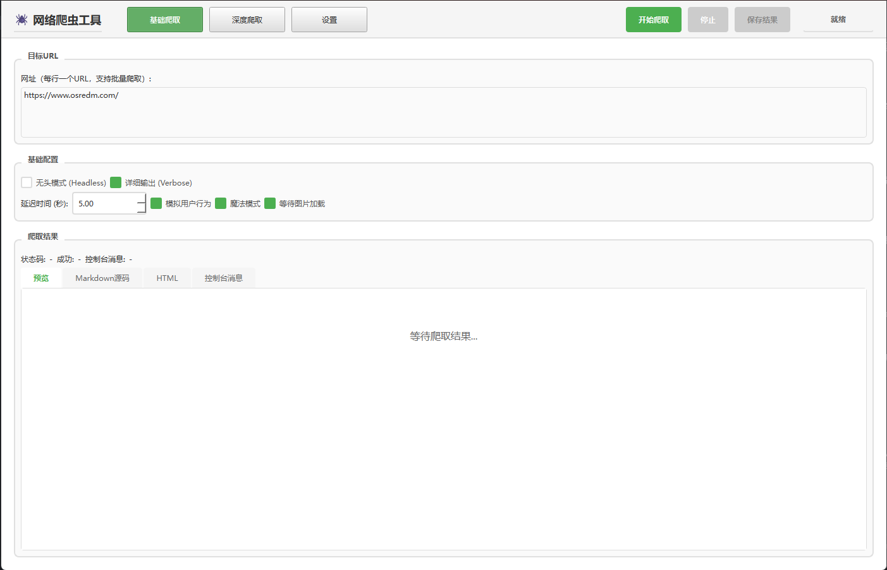
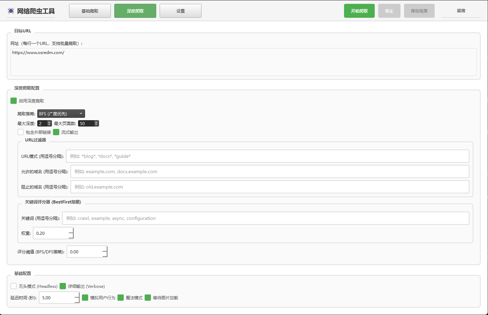

# 🕷️ 网络爬虫工具 (Web Crawler GUI)

基于 Crawl4AI 和 PyQt6 开发的图形化网络爬虫工具，支持单页爬取、深度爬取和批量爬取功能。

## 📸 界面预览

### 主界面



### 深度爬取配置



## ✨ 功能特性

### 🎯 核心功能

- **单页爬取**：快速爬取单个网页的内容
- **深度爬取**：支持 BFS、DFS、BestFirst 三种爬取策略
- **批量爬取**：支持多 URL 批量爬取，每行一个 URL
- **结果预览**：实时预览 Markdown 渲染结果
- **结果保存**：支持单独保存每个 URL 的结果

### 🎨 界面特性

- **现代化 UI**：采用 PyQt6 构建的现代化界面
- **主题切换**：支持亮色/暗色主题切换
- **页面导航**：顶部导航栏，快速切换不同功能页面
- **实时状态**：右上角实时显示爬取状态和进度

### 🔧 高级功能

- **浏览器检测绕过**：内置 JavaScript 代码绕过浏览器检测
- **URL 过滤**：支持 URL 模式过滤、域名过滤
- **关键词评分**：BestFirst 策略支持关键词相关性评分
- **流式输出**：深度爬取支持流式输出，实时显示结果
- **默认保存路径**：可设置默认保存路径，提高效率

## 📋 系统要求

- Python >= 3.12
- Windows / Linux / macOS

## 🚀 安装

### 1. 克隆项目

```bash
git clone <repository-url>
cd webcrawl
```

### 2. 安装依赖

使用 uv（推荐）：

```bash
uv sync
```

### 3. 运行应用

```bash
uv run python main.py
```

或直接运行：

```bash
python main.py
```

## 📦 打包为可执行文件

### 使用 PyInstaller 打包

#### 方法一：使用 uv 环境打包（推荐）

如果您使用 uv 管理项目依赖：

1. 安装打包工具：

```bash
uv pip install pyinstaller
```

2. 运行 uv 打包脚本：

```bash
python build_exe_uv.py
```

或直接使用命令：

```bash
uv run pyinstaller --name=WebCrawler --windowed --onefile --add-data="webcrawl;webcrawl" --collect-all=PyQt6 --collect-all=crawl4ai main.py
```

#### 方法二：使用标准 Python 环境打包

1. 安装打包依赖：

```bash
pip install pyinstaller
```

2. 运行打包脚本：

```bash
python build_exe.py
```

打包完成后，可执行文件位于 `dist/WebCrawler.exe`

#### 方法三：使用 .spec 文件

1. 安装 PyInstaller：

```bash
pip install pyinstaller
```

或使用 uv：

```bash
uv pip install pyinstaller
```

2. 使用 spec 文件打包：

```bash
pyinstaller webcrawl.spec
```

或使用 uv：

```bash
uv run pyinstaller webcrawl.spec
```

#### 方法四：直接使用 PyInstaller 命令

```bash
pyinstaller --name=WebCrawler --windowed --onefile --add-data="webcrawl;webcrawl" --collect-all=PyQt6 --collect-all=crawl4ai main.py
```

### 打包选项说明

- `--windowed` / `-w`：不显示控制台窗口（GUI 应用）
- `--onefile` / `-F`：打包成单个可执行文件
- `--name`：指定生成的可执行文件名称
- `--add-data`：添加数据文件或目录
- `--hidden-import`：添加隐藏导入的模块
- `--icon`：指定图标文件（.ico 格式）

### 打包注意事项

1. **文件大小**：由于包含了 PyQt6 和 WebEngine，打包后的文件可能较大（100MB+）
2. **首次运行**：首次运行可能需要较长时间解压文件
3. **依赖检查**：确保所有依赖都已正确安装
4. **测试**：打包后建议在干净的 Windows 系统上测试运行

### 减小文件大小（可选）

如果文件太大，可以使用以下选项：

```bash
pyinstaller --name=WebCrawler --windowed --onedir --add-data="webcrawl;webcrawl" main.py
```

使用 `--onedir` 替代 `--onefile` 会生成一个文件夹，包含可执行文件和依赖库，文件会更小但需要保持文件夹结构。

## 📖 使用指南

### 基础爬取

1. 打开应用，默认进入"基础爬取"页面
2. 在"目标 URL"输入框中输入要爬取的 URL（支持批量，每行一个）
3. 配置爬取选项：
   - **无头模式**：是否在后台运行浏览器
   - **详细输出**：是否显示详细日志
   - **延迟时间**：页面加载后的等待时间（秒）
   - **模拟用户行为**：模拟真实用户操作
   - **魔法模式**：启用高级反检测功能
   - **等待图片加载**：等待页面图片完全加载
4. 点击右上角"开始爬取"按钮
5. 等待爬取完成，查看结果
6. 点击"保存结果"按钮保存到本地

### 深度爬取

1. 切换到"深度爬取"页面
2. 输入目标 URL（支持批量）
3. 勾选"启用深度爬取"
4. 配置深度爬取选项：
   - **爬取策略**：选择 BFS（广度优先）、DFS（深度优先）或 BestFirst（最佳优先）
   - **最大深度**：设置爬取的最大深度（1-10）
   - **最大页面数**：限制爬取的页面数量（1-1000）
   - **包含外部链接**：是否爬取外部域名链接
   - **流式输出**：实时显示爬取结果
5. 配置 URL 过滤器（可选）：
   - **URL 模式**：使用通配符匹配 URL（如 `*blog*`, `*docs*`）
   - **允许的域名**：只爬取指定域名的链接
   - **阻止的域名**：排除指定域名的链接
6. 配置关键词评分器（BestFirst 策略）：
   - **关键词**：用逗号分隔的关键词列表
   - **权重**：关键词的权重（0.0-1.0）
   - **评分阈值**：BFS/DFS 策略的评分阈值
7. 点击"开始爬取"开始深度爬取

### 批量爬取

1. 在 URL 输入框中输入多个 URL，每行一个：
   ```
   https://www.example.com/
   https://www.example2.com/
   https://www.example3.com/
   ```
2. 配置爬取选项（与单页爬取相同）
3. 点击"开始爬取"
4. 系统会逐个爬取每个 URL，显示进度（当前/总数）
5. 所有 URL 爬取完成后，结果会合并显示
6. 保存时，每个 URL 的结果会单独存储到各自的文件夹

### 设置

1. 切换到"设置"页面
2. **主题设置**：点击按钮切换亮色/暗色主题
3. **默认保存路径**：
   - 点击"浏览..."选择默认保存目录
   - 设置后，保存结果时会自动使用该路径
   - 点击"清除"可移除默认路径

## 📁 项目结构

```
webcrawl/
├── main.py                 # 应用程序启动入口
├── pyproject.toml          # 项目配置和依赖
├── README.md               # 项目说明文档
├── webcrawl/               # 主包目录
│   ├── __init__.py         # 包初始化
│   ├── main_window.py      # 主窗口 UI 和业务逻辑
│   ├── worker.py           # 爬虫工作线程
│   ├── utils.py            # 工具函数（Markdown 渲染等）
│   └── config.py           # 配置构建模块（深度爬取策略）
└── gui.py                  # 原始 GUI 文件（已重构）
```

## 💾 结果保存

### 单页爬取结果

```
result_{timestamp}.md          # Markdown 文件
result_{timestamp}.html        # HTML 文件
console_{timestamp}.txt       # 控制台消息
```

### 深度爬取结果

```
page_1/                        # 页面 1 文件夹
  ├── page_1.md
  ├── page_1.html
  └── page_info.txt
page_2/                        # 页面 2 文件夹
  ├── page_2.md
  ├── page_2.html
  └── page_info.txt
combined_{timestamp}.md        # 合并的 Markdown
combined_{timestamp}.html      # 合并的 HTML
combined_console_{timestamp}.txt  # 合并的控制台消息
```

### 批量爬取结果

```
batch_crawl_{timestamp}/
├── url_1_{url_safe_name}/     # URL 1 的结果文件夹
│   ├── result_{timestamp}.md
│   ├── result_{timestamp}.html
│   ├── console_{timestamp}.txt
│   └── url_info.txt
├── url_2_{url_safe_name}/     # URL 2 的结果文件夹
│   └── ...
└── batch_summary.txt          # 批量爬取汇总信息
```

## 🎨 界面说明

### 顶部导航栏

- **应用标题**：显示应用名称和图标
- **导航按钮**：基础爬取、深度爬取、设置
- **控制按钮**：开始爬取、停止、保存结果
- **状态显示**：实时显示当前爬取状态

### 基础爬取页面

- URL 输入区域
- 基础配置选项
- 结果显示区域（预览、Markdown 源码、HTML、控制台消息）

### 深度爬取页面

- URL 输入区域
- 深度爬取配置
- URL 过滤器
- 关键词评分器
- 基础配置选项

### 设置页面

- 主题设置
- 默认保存路径设置
- 关于信息

## ⚙️ 配置说明

### 浏览器配置

- **无头模式**：浏览器在后台运行，不显示窗口
- **详细输出**：显示详细的爬取日志信息

### 爬取配置

- **延迟时间**：页面加载后等待的时间（秒），建议 3-5 秒
- **模拟用户行为**：模拟鼠标移动、滚动等操作
- **魔法模式**：启用高级反检测功能
- **等待图片加载**：等待页面图片完全加载后再提取内容

### 深度爬取策略

#### BFS (广度优先)

- 先爬取同一深度的所有页面，再进入下一层
- 适合需要全面覆盖的场景

#### DFS (深度优先)

- 沿着链接深入爬取，直到达到最大深度
- 适合需要深入探索的场景

#### BestFirst (最佳优先)

- 根据关键词相关性评分，优先爬取评分高的页面
- 适合需要聚焦特定内容的场景

## 🔍 常见问题

### Q: 爬取失败怎么办？

A: 检查以下几点：

- URL 是否正确
- 网络连接是否正常
- 目标网站是否有反爬虫机制（尝试启用"魔法模式"）
- 延迟时间是否足够（建议 5 秒以上）

### Q: 深度爬取很慢怎么办？

A: 可以尝试：

- 减少最大深度
- 减少最大页面数
- 使用 URL 过滤器限制范围
- 启用流式输出查看实时进度

### Q: 如何提高爬取成功率？

A: 建议：

- 启用"魔法模式"和"模拟用户行为"
- 增加延迟时间
- 使用合适的 User-Agent
- 避免过于频繁的请求

### Q: 批量爬取时如何停止？

A: 点击右上角"停止"按钮，已爬取的结果会保留

## 🛠️ 开发

### 项目依赖

- `crawl4ai>=0.7.6`：核心爬虫引擎
- `PyQt6>=6.6.0`：GUI 框架
- `PyQt6-WebEngine>=6.6.0`：Web 引擎（用于 Markdown 预览）
- `markdown>=3.5.0`：Markdown 渲染

### 代码结构

- `main_window.py`：主窗口类，包含所有 UI 和业务逻辑
- `worker.py`：爬虫工作线程，处理异步爬取任务
- `utils.py`：工具函数，包括 Markdown 渲染和 HTML 生成
- `config.py`：配置构建模块，构建深度爬取策略

## 📝 更新日志

### v0.1.0

- ✨ 初始版本发布
- ✨ 支持单页爬取和深度爬取
- ✨ 支持批量 URL 爬取
- ✨ 支持亮色/暗色主题切换
- ✨ 支持结果预览和保存
- ✨ 支持默认保存路径设置

## 📄 许可证

本项目采用 MIT 许可证。

## 🤝 贡献

欢迎提交 Issue 和 Pull Request！

## 📧 联系方式

如有问题或建议，请提交 Issue。

---

**注意**：请遵守目标网站的 robots.txt 和使用条款，合理使用爬虫工具。
